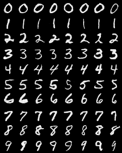

# Conditional Deep Convolutional Generative Adversarial Network 

Conditional Generation of MNIST images using conditional DC-GAN in PyTorch.

Based on the following papers:
* [Conditional Generative Adversarial Nets](https://arxiv.org/abs/1411.1784)
* [Unsupervised Representation Learning with Deep Convolutional Generative Adversarial Networks](http://arxiv.org/abs/1511.06434)

Implementation inspired by the PyTorch examples [implementation of DCGAN](https://github.com/pytorch/examples/tree/master/dcgan).

## Sample Results
Example of sampling results shown below. Each row is conditioned on a different digit label:

## Usage
```
python conditional_dcgan.py --cuda --save_dir=models --samples_dir=samples --epochs=25
```

## Questions and comments:

Feel free to reach to me at `malzantot [at] ucla [dot] edu` for any questions or comments.
